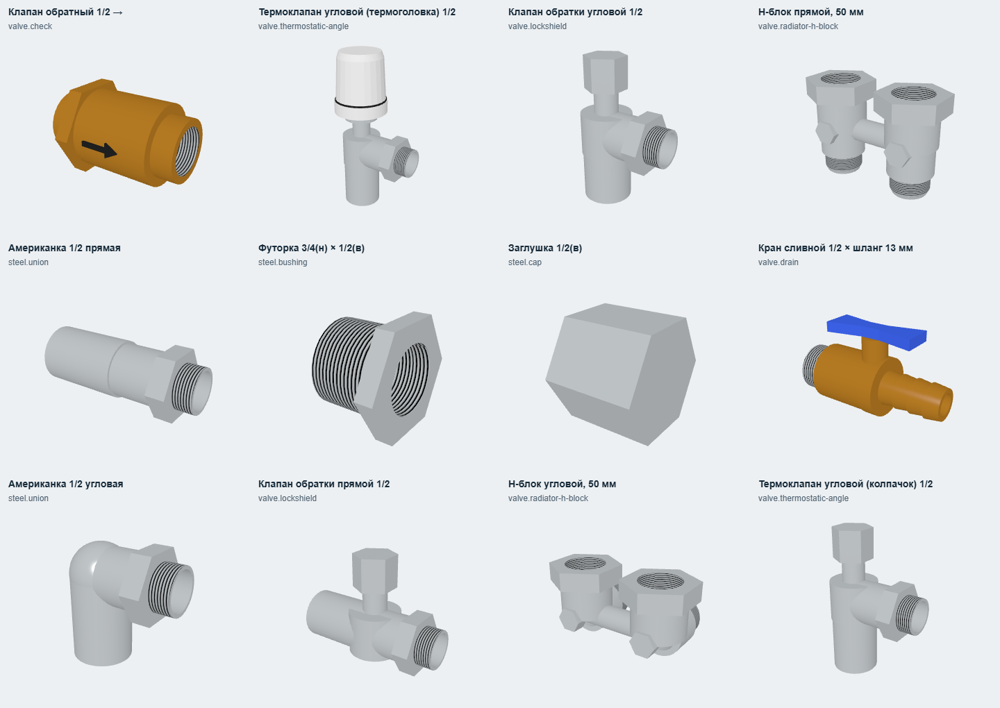

# Новые модели каталога

Добавлены 10 октября 2026. Первая очередь: 8 генераторов, 31 позиция каталога
в `src/lib/catalog/extensions.ts`. Всего в реестре 48 генераторов.

Это обобщённые параметрические модели для визуализации и проверки стыковки.
Размеры наборов не являются паспортными размерами изделий производителя.
Резьбовые диаметры используют существующую таблицу `ThreadSizes` для совместимости
с перенесёнными моделями. Гидравлика, внутренние механизмы и поворот ручек не моделируются.

| Модель | ID | Варианты и параметры |
| --- | --- | --- |
| Обратный клапан | `valve.check` | Номинал, длина, направление стрелки потока |
| Угловой термоклапан | `valve.thermostatic-angle` | Номинал, плечо, колпачок или термоголовка |
| Клапан обратки | `valve.lockshield` | Номинал, плечо, прямое/угловое исполнение |
| H-блок | `valve.radiator-h-block` | Прямой/угловой, межосевое расстояние, высота, номинал к радиатору |
| Американка В–Н | `steel.union` | Прямая/угловая, номинал, плечо |
| Футорка | `steel.bushing` | Наружный и внутренний номиналы, длина; проверка толщины стенки |
| Заглушка В | `steel.cap` | Номинал, длина, глухое дно |
| Сливной кран | `valve.drain` | Наружная резьба, длина, штуцер под шланг 13/16/20 мм |

`armLength` — расстояние от центра корпуса до торца каждого плеча.
Для H-блока `height` — расстояние между торцами прямой модели; в угловой
каждое плечо равно `height / 2`. ID портов сохраняются при переключении исполнения.

## Соединения и ограничения

- У клапанов радиатора вход `inlet` — внутренняя резьба; `radiator` — наружная резьба
  полусгона. У американки — `inlet` и `outlet`. У сливного крана — `inlet` и `hose`.
- H-блок: `radiator-left/right` направлены вверх, `pipe-left/right` — вниз
  в прямом исполнении и назад в угловом. Перемычка механическая, без байпаса.
- Выходы H-блока к трубам имеют `joint: 'eurocone'`, номинал `'3/4'`,
  условную глубину посадки 3 мм. Они не совместимы с обычной `thread`.
  Верхние порты обобщённой модели — внутренняя резьба; адаптеры к конкретному радиатору
  не включены. Существующий стальной радиатор имеет боковые порты: модель радиатора
  с парой нижних подключений и адаптеры евроконуса остаются следующими задачами.
- Штуцер сливного крана имеет `joint: 'hose-barb'`. Номинал — внутренний диаметр
  шланга в миллиметрах строкой. Модель шланга пока отсутствует.
- Стрелка обратного клапана задаёт визуальное направление потока; `ConnectorMating`
  проверяет геометрическую совместимость соединений, не направление потока.

На стенде добавлены три совместимые демонстрационные сборки и одна ошибочная
для проверки отличия евроконуса от обычной резьбы.

## Проверки

Новые модели проходят общие проверки каталога и отдельные `catalogExtensions`:
порты, варианты, ограничения размеров и совместимость. Перенесённая часть каталога
по-прежнему строго сверяется с `gl2`; фикстуры старого проекта не изменяются.

Снимок: локальный Vite на порту 5199 и отдельный headless Chrome с CDP на порту 9225,
затем `node scripts/extensions-snapshot.mjs`. Скрипт закрывает только созданную им вкладку.

Визуальные ориентиры: [обратный клапан со стрелкой](https://valtec.ru/catalog/reguliruyuschaya_armatura/obratnye_klapany/obratnyj_klapan_nikelirovannyj_vt161n.html),
[угловой термоклапан](https://valtec.ru/catalog/radiatornaya_armatura/termostaticheskie_klapany_dlya_radiatorov/klapan_termostaticheskij_uglovoj_s_dopolnitelnym_uplotneniem.html),
[угловой H-блок с шагом 50 мм](https://valtec.ru/catalog/radiatornaya_armatura/ruchnye_klapany_dlya_radiatorov/uzel_uglovoj_dlya_nijnego_podklyucheniya_radiatora.html).
Модели не заявлены копиями этих изделий.
